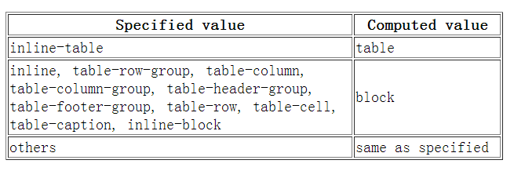

- type: reply
- tag: css
- difficulty:  1
- from: https://github.com/qiu-deqing/FE-interview

--------

display,float,position的关系

---------

1. 如果``display``为none，那么position和float都不起作用，这种情况下元素不产生框
2. 否则，如果position值为absolute或者fixed，框就是绝对定位的，float的计算值为none，display根据下面的表格进行调整。
3. 否则，如果float不是none，框是浮动的，display根据下表进行调整
4. 否则，如果元素是根元素，display根据下表进行调整
5. 其他情况下display的值为指定值
总结起来：**绝对定位、浮动、根元素都需要调整``display``**

