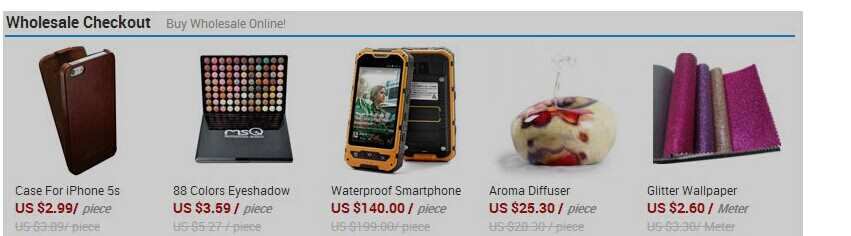

- type: reply
- tag: javascript
- difficulty:  1
- from: https://github.com/hawx1993/Front-end-Interview-questions

--------

请用原生js实现一个函数,给页面制定的任意一个元素添加一个透明遮罩(透明度可变,默认0.2),使这个区域点击无效,要求兼容IE8+及各主流浏览器,遮罩层效果如下图所示:

---------



```
<style>
#target {
    width: 200px;
    height: 300px;
    margin: 40px;
    background-color: tomato;
}
</style>

<div id="target"></div>

<script>
function addMask(elem, opacity) {
    opacity = opacity || 0.2;

    var rect = elem.getBoundingClientRect();
    var style = getComputedStyle(elem, null);

    var mask = document.createElement('div');
    mask.style.position = 'absolute';
    var marginLeft = parseFloat(style.marginLeft);
    mask.style.left = (elem.offsetLeft - marginLeft) + 'px';
    var marginTop = parseFloat(style.marginTop);
    mask.style.top = (elem.offsetTop - marginTop) + 'px';
    mask.style.zIndex = 9999;
    mask.style.opacity = '' + opacity;
    mask.style.backgroundColor = '#000';

    mask.style.width = (parseFloat(style.marginLeft) +
        parseFloat(style.marginRight) + rect.width) + 'px';
    mask.style.height = (parseFloat(style.marginTop) +
        parseFloat(style.marginBottom) + rect.height) + 'px';

    elem.parentNode.appendChild(mask);
}

var target = document.getElementById('target');
addMask(target);

target.addEventListener('click', function () {
    console.log('click');
}, false);
</script>
```

